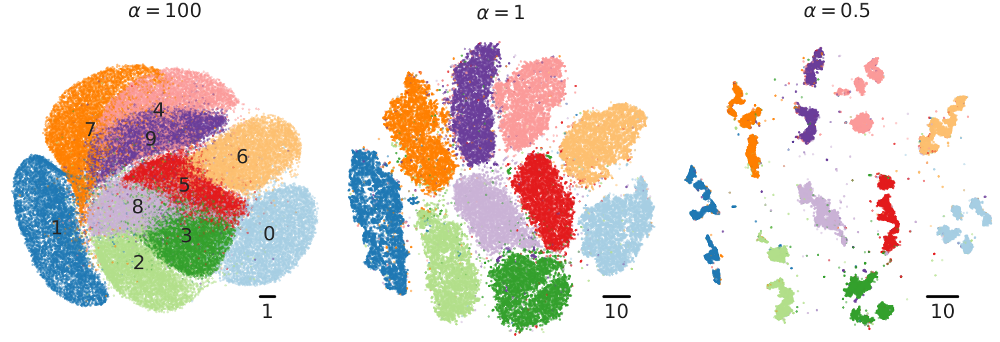

# Heavy-tailed kernels reveal a finer cluster structure in t-SNE visualisations

This is a companion repository to our preprint https://arxiv.org/abs/1902.05804 (Kobak, Linderman, Steinerberger, Kluger, and Berens, 2019, Heavy-tailed kernels reveal a finer cluster structure in t-SNE visualisations). All code for the paper is in a Python Jupyter notebook [heavy-tailed-tsne.ipynb](https://github.com/dkobak/finer-tsne/blob/master/heavy-tailed-tsne.ipynb). We use this t-SNE implementation: https://github.com/KlugerLab/FIt-SNE, version 1.1.0.

For any technical questions, please start an Issue.

&nbsp;&nbsp;&nbsp;&nbsp;&nbsp;&nbsp;&nbsp;&nbsp;&nbsp;&nbsp;&nbsp;&nbsp;&nbsp;&nbsp;&nbsp;&nbsp;&nbsp;&nbsp;&nbsp;&nbsp;&nbsp;&nbsp;&nbsp;&nbsp;&nbsp;&nbsp;&nbsp;&nbsp;&nbsp;&nbsp;&nbsp;&nbsp;&nbsp;&nbsp;&nbsp;&nbsp;&nbsp;&nbsp;&nbsp;&nbsp;&nbsp;&nbsp;&nbsp;&nbsp;&nbsp;&nbsp;&nbsp;&nbsp;&nbsp;&nbsp;&nbsp;&nbsp;&nbsp;&nbsp;
